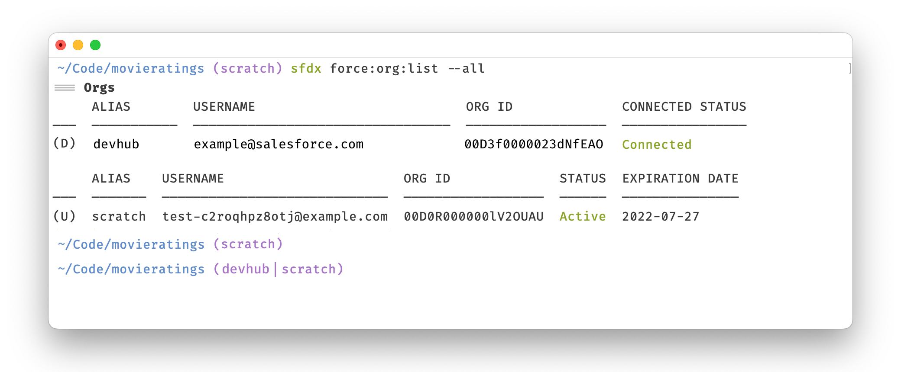

# Org Prompt

Very simple utility that displays your current Salesforce Default Org and Default Dev Hub in your Terminal prompt.

By default, only the Default Org is displayed. If you want to display both just pass the flag like this `org -devhub`.



## Install

1. `git clone git@github.com:marcelinollano/orgprompt.git`
2. `go build ./org.go`
3. `cp ./org /usr/local/bin`
4. `vim ~/.zshrc`
5. Tweak your prompt, example:

   ```sh
   precmd_functions+=(set_org)
   function set_org {
     ORG="%{$fg[magenta]%}$(org)%{$reset_color%}"
   }
   DIR="%{$fg[blue]%}%3~%{$reset_color%}"
   PROMPT='$DIR $ORG'
   ```
